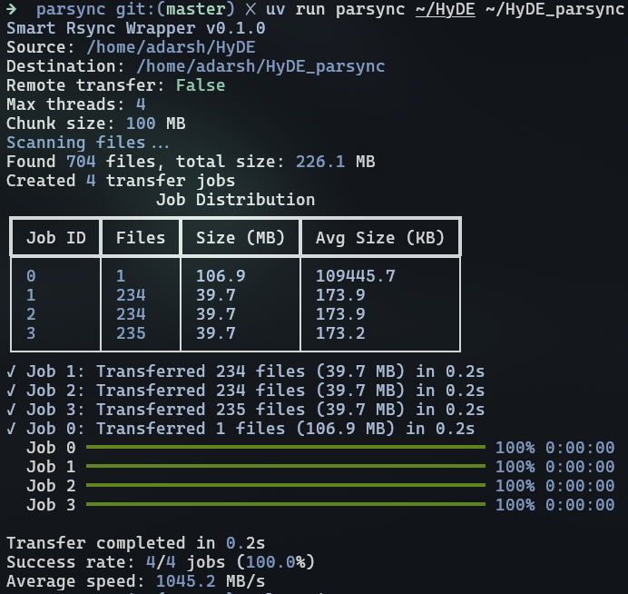

# Parsync



## To run in development
```bash
uv run parsync --help

```

## To install
```bash
uv tool install .
```

## Usage
```bash
# Basic usage
parsync /source/ /destination/

# Advanced options
parsync -t 4 --chunk-size 200 --rsync-args "-av --exclude=*.tmp" /src/ remote:/dst/

# Dry run
parsync --dry-run /source/ /destination/
```
